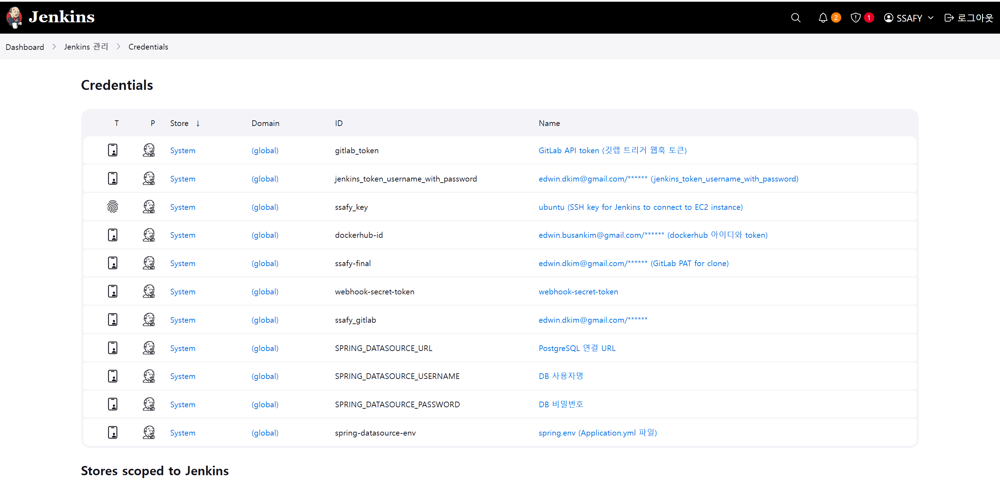

# 포팅 매뉴얼

# 1. 개발 환경

## 1.1. Frontend

| 분류 | 기술스택 | 버전 | 설명 |
| --- | --- | --- | --- |
| **기본 프레임워크** | **React** | 19.1.0 | UI 라이브러리 |
|  | **React DOM** | 19.1.0 | React 렌더링 |
|  | **React Router DOM** | 7.5.2 | 라우팅 관리 |
|  | TypeScript | 4.9.5 | 정적 타입 지원 |
| **상태관리** | **Zustand** | 5.0.3 | 상태 관리 |
|  | **Immer** | 10.1.1 | 불변 상태 관리 |
| **UI 및 접근성** | **Tailwind CSS** | 4.0.15 | 유틸리티 CSS |
|  | **React Headless UI** | 2.2.1 | 접근성 높은  UI |
|  | **React Modal** | 3.16.3 | 모달 창 관리 |
| **통신/보안** | **Axios** | 1.8.4 | HTTP |
|  | socket.io-client | 4.8.1 | 실시간 통신 (WebSocket) |
|  | **JWT-Decode** | 4.0.0 | JWT 디코딩 라이브러리 |
| **테스트** | @testing-library/react | 16.3.0 | React UI 테스트 |
|  | @testing-library/user-event | 13.5.0 | 사용자 이벤트 시뮬레이션 |
|  | @testing-library/jest-dom | 6.6.3 | DOM 관련 matcher 추가 |
| **개발도구** | **ESLint** | 9.21.0 | 코드 검새 |
|  | **Prettier** | 2.6.0 | 코드 포맷팅 |
|  | concurrently | 9.1.2 | 병렬 명령 실행 도구 |
|  | cross-env | 7.0.3 | OS 간 환경변수 설정 통일 |
|  | wait-on | 8.0.3 | 특정 URL/포트 대기 유틸 |
|  | **@tailwindcss/vite** | 4.0.15 | Tailwind + Vite 통합 |
| **빌드 도구** | **Vite** | 6.3.3 | 빠른 빌드 도구 |
|  | @vitejs/plugin-react | 4.4.1 | Vite용 React 플러그인 |
|  | vite-tsconfig-paths | 5.1.4 | TS 경로 별칭 지원 |
| **런타임** | Node.js | 18.20.6 | 서버 사이드 JavaScript 실행 환경 |
| **Electron** | electron | 35.2.1 | 데스크톱 앱 프레임워크 |
|  | electron-builder | 26.0.12 | Electron 빌드 및 배포 도구 |

## 1.2. Backend

| 기술스택 | 버전 | 설명 |  |
| --- | --- | --- | --- |
| **Java** | 17 | JDK 및 런타임 환경 |  |
| **Spring** | 6.2.3 | Java 애플리케이션 프레임워크 |  |
| **Spring Boot** | 3.4.5 | Spring 애플리케이션 부트스트래핑 |  |
| MyBatis | 3.0.4 | SQL Mapper 프레임워 |  |
| PostgreSQL JDBC | 3.4.3 | PostgreSQL 연결용 JDBC 드라이버 |  |
| **Spring WebSocket** | 6.2.3 | 실시간 양방향 통신 지원 |  |
| **Lombok** | 1.18.36 | 코드 자동 생성 라이브러리 |  |
| JUnit(Jupiter) | 5.11.4 | 단위 테스트 실행 도구 |  |
| MyBatis Test Starter | 3.0.4 | MyBatis 통합 테스트 지원 |  |
| Spring Dependency Management | 1.1.7 | BOM 기반 의존성 관리 |  |
| Gradle | 8.1.3 | 자동화된 빌드 및 의존성 관리 |  |
| Spring DevTools |  | 핫 리로딩, 자동 재시작 기능 |  |

### 1.3 FAST API

| 분류 | 기술스택 | 버전 | 설명 |
| --- | --- | --- | --- |
| 웹 프레임워 | fastapi | 0.104.1 | 비동기 웹 프레임워크 |
| 웹 서버 | uvicorn | 0.23.2 | ASGI 서버 |
| 데이터베이스 | sqlalchemy | 2.0.22 | ORM |
| DB 연결 | psycopg2-binary | 2.9.9 | PostgreSQL 드라이버 |
| 환경 변수 | python-dotenv | 1.0.0 | .env 로드 |
| 실시간 통신 | python-socketio | 5.13.0 | Socket.IO 클라이언트 |
| WebSocket | websockets | 11.0.3 | ASGI WebSocket |
| 멀티파트 | python-multipart | 0.0.6 | 파일 업로드 처리 |
| Redis 캐시 | redis | 5.0.1 | 캐시 및 pub/sub |
| 데이터 처리 | numpy, pandas, scipy, tqdm, pillow | 4.11.0.86 | 영상 분석 |
| 머신러닝 | tensorflow | 2.15.0 | 딥러닝 프레임워크 |
| 시각화 | matplotlib | 최신 | 그래프 및 시각화 |

## 1.3. Server

| 소프트웨어 | 버전 | 설명 |
| --- | --- | --- |
| **Ubuntu** | 22.04.5 LTS | 서버 운영체제 |
| **Nginx** | alpine | Reverse Proxy 및 Static 파일 서빙 |
| **Docker** | 26.1.3 | 컨테이너 가상화 플랫폼 |
| Docker-Compose | 2.27.0 | 다중 컨테이너 애플리케이션 관리 |
| Jenkins |  | Jenkins CI/CD 파이프라인 실행 |

## 1.4. Database

- PostgreSQL
- Redis : 5.0.1

## 1.5. IDE

- Visual Studio Code : 1.98.2
- IntelliJ IDEA :  2024.3.1.1

## 1.6. 형상/이슈관리

- GitLab
- Jira

## 1.7. 기타 툴

- Postman

---

# 2. 환경변수

### 2.2 Backend (application.yml 또는 GitLab CI/CD 환경 변수)

- SPRING_DATASOURCE_URL
- SPRING_DATASOURCE_USERNAME
- SPRING_DATASOURCE_PASSWORD

# 3. 배포 방식

## 3.1 수동 배포 (EC2 기준)

1. EC2 인스턴스 접속

```bash
ssh -i [your-key].pem ubuntu@your-ec2-ip
```

1. **Docker 및 Docker Compose 설치**

```bash
sudo apt update
sudo apt install docker.io
sudo systemctl start docker
sudo systemctl enable docker
sudo apt install docker-compose
```

설치 확인:

```bash
docker --version
docker-compose version
```

1. **이미지 Pull 및 실행**
- 로컬에서 빌드한 이미지를 Docker Hub에 push
- EC2에서 pull 후 실행

```bash
docker pull [이미지명]
docker-compose up -d
```

---

# 4. EC2 세팅

## 4.1. EC2 Port

| 포트 번호 | 용도 |
| --- | --- |
| 22 | SSH 접속 |
| 80 | HTTP(웹서버, nginx) |
| 443 | HTTPS(SSL 웹서버) |
| 8080 | Spring Boot |
| 3000 | React 개발 서버 |
| 6379 | Redis |

## 4.2. 서버 방화벽(UFW) 설정

```bash
22                         ALLOW       Anywhere
80                         ALLOW       Anywhere
8989                       ALLOW       Anywhere
8081                       ALLOW       Anywhere
8081/tcp                   ALLOW       Anywhere
443                        ALLOW       Anywhere
443/tcp                    ALLOW       Anywhere
22 (v6)                    ALLOW       Anywhere (v6)
80 (v6)                    ALLOW       Anywhere (v6)
8989 (v6)                  ALLOW       Anywhere (v6)
8081/tcp (v6)              ALLOW       Anywhere (v6)
443 (v6)                   ALLOW       Anywhere (v6)
443/tcp (v6)               ALLOW       Anywhere (v6)
```

## 4.3. Redis & PostgreSQL 포팅 매뉴얼

### 1. 전제 조건

- 환경 변수는 `.env` 파일 또는 Jenkins CI/CD의 환경 변수로 관리합니다.
- 모든 서비스는 `app-network`라는 공통 네트워크로 연결되어 있습니다.
- Docker Compose 버전은 **3.8**입니다

### 2. 환경 변수 예시 (.env)

```
SPRING_DATASOURCE_URL=jdbc:postgresql://k12e101.p.ssafy.io:5432/turkey_games
SPRING_DATASOURCE_USERNAME=postgres
SPRING_DATASOURCE_PASSWORD=1234

REDIS_PORT=6379
```

.env 파일은 Git에 커밋하지 않도록 .gitignore에 반드시 추가합니다.

---

### 3. PostgreSQL 설정 (Docker 컨테이너 기반)

PostgreSQL은 **EC2 내부의 Docker 컨테이너로 실행**하며, Spring Boot 애플리케이션은 .env 파일을 통해 해당 컨테이너에 접근합니다.

---

### 🔹 PostgreSQL 실행 정보

| 항목 | 값 |
| --- | --- |
| 컨테이너 이름 | `postgres` |
| 이미지 | `postgres:latest` |
| 외부 포트 | `5432` |
| 내부 포트 | `5432` |

---

### 4. Redis 설정

- 본 프로젝트에서는 Redis가 FastAPI 서비스 내부에서 비동기 작업 큐 및 캐시 용도로 사용되며,
- 별도로 Docker Compose에 Redis 컨테이너를 구성하지 않습니다.
- Redis는 FastAPI 서비스 이미지 내부 또는 외부 Redis 서버에 의해 자동으로 연결되므로, 포팅 시 별도의 Redis 설정은 필요하지 않습니다.

### 5. 네트워크 및 볼륨 설정

---

```yaml
services:
  jenkins:
    ...
    volumes:
      - ./volumes/jenkins:/var/jenkins_home
    networks:
      - app-network

  backend:
    ...
    networks:
      - app-network

  fastapi:
    ...
    networks:
      - app-network

  nginx:
    ...
    networks:
      - app-network

networks:
  app-network:

```

---

### 6. 실행 방법

```bash
docker-compose up -d
```

- d : 백그라운드 실행
- .env : 파일이 현재 디렉토리에 존재해야 변수 적용됨

---

### 7. 보안 관련 유의사항

- .env 파일은 Git에 절대 커밋하지 않도록 .gitignore에 포함할 것
- 운영 환경에서는 환경변수를 .env 파일 대신 CI/CD 변수로 관리할 것
- Docker Compose에서 직접 값을 작성하지 말고 환경변수 참조 방식 사용 권장

---

## 6. Jenkins CI/CD 자동 배포 구성

### 6.1 Jenkins 설치 및 접근

- 저희 프로젝트는 Jenkins를 EC2에 직접 설치하지 않고, Docker Compose를 통해 컨테이너로 실행합니다.
- Jenkins 컨테이너 이름: jenkins
- 포트 매핑: 8081 (외부) → 8080 (내부)
- 접근 주소:  [http://k12e101.p.ssafy.io:8081](http://k12e101.p.ssafy.io:8081/)
- Jenkins는 docker-node 에이전트 라벨을 통해 파이프라인을 실행합니다.

### 6.2 전체 배포 흐름 요약

본 프로젝트는 Jenkins와 GitLab Webhook을 기반으로 자동 배포 파이프라인을 구성합니다.

프론트엔드(React), FastAPI, Spring Boot 백엔드는 **각각 독립된 Jenkins 파이프라인**으                                                                                                                                                                                                                                                                                                                                                                                     로 자동 빌드 및 배포됩니다.

| 단계 | 설명 |
| --- | --- |
| **GitLab Merge Request 발생** | 특정 브랜치(MR)에서 파이프라인 트리거 |
| **Jenkins에서 GitLab Clone** | 대상 브랜치를 Git에서 클론 |
| **Docker Build & Push** | 해당 애플리케이션의 Docker 이미지 빌드 후 DockerHub에 푸시 |
| **Remote Deploy (EC2)** | SSH로 EC2 접속 → `docker-compose`를 통해 재배포 |
| **후처리** | Docker 이미지 정리 (`image prune -f`) 수행 |

---

### 6.3 사용 도구 및 구성

| 구성 요소 | 기술 |
| --- | --- |
| CI 도구 | Jenkins (docker-node 에이전트) |
| VCS | GitLab (WebHook 연동) |
| 빌드 도구 | Docker |
| 배포 서버 | AWS EC2 (Ubuntu 20.04) |
| 인증 방식 | DockerHub Credentials, SSH Key |
| 배포 방식 | `docker-compose up -d` |

---

### 6.4 브랜치 전략 및 트리거 조건

| 파이프라인 | 트리거 조건 | 브랜치 |
| --- | --- | --- |
| 프론트엔드 (`frontend`) | Merge Request 발생 시 | `develop`, `master`, `develop-react` |
| FastAPI (`fastapi`) | Merge Request 발생 시 | `develop-fastapi` |
| 백엔드(Spring) | 수동 트리거 또는 추후 추가 예정 | `develop`, `feature/infra-env` |

### 6.5 Jenkins 파이프라인 단계 요약

```tsx
1. GitLab Merge 감지
2. Jenkins Webhook Trigger 발동
3. Git clone
4. Docker Build & Push
5. SSH로 EC2 접속
6. docker-compose pull + up -d
7. Post: 성공 메시지 + Docker 이미지 정리
```

모든 파이프라인은 Webhook 기반 GitLab 이벤트로 실행되며, Jenkins에서 docker build, push, remote,  deploy를 포함한 단계별 자동화가 설정되어 있습니다.

### 6.6 민감 환경 변수 지정하기 - Jenkins

- Jenkins [Cred](http://k12e101.p.ssafy.io:8081/manage/credentials/)entials에 민감한 정보들을 환경 변수로 등록한다.



### 7. 시연 시나리오

1. 대시보드-> 메인화면 -> 게임 검색하기
2. 게임 검색 화면 
    1. 칠면조 다이스 선택 및 설명보기 ( 줄글 설명 -> 영상설명)
3. 게임 시작 버튼 누르기
    1. 플레이어수 고르기
    2. 게임판 고르기
    3. Tts 고르기 
    4. 다 고른후 게임시작
4. 게임 보드 위 플레이어 위치 선택
5. 게임 시작
    1. 자리 스크린 터치로 선택
    2. 플레이어 1 주사위 굴리기 -> 리롤 하기 -> 나온값 점수판에 터치하여 입력하기
        1. 이펙트 및 소리 시연
        2. 대시보드에서 점수현황 같이 확인
    3. 플레이어 2 주사위 굴리기(야추로 조정해서 하이라이트 생성 기능 시연)
    4. 1-2턴내로 종료 
6. 결과창 이동
    1. 대시보드
        1. 게임결과 확인 -> 하이라이트 클릭 -> QR 코드 다운로드 하기
    2. 게임보드
        1. 하이라이트 재생