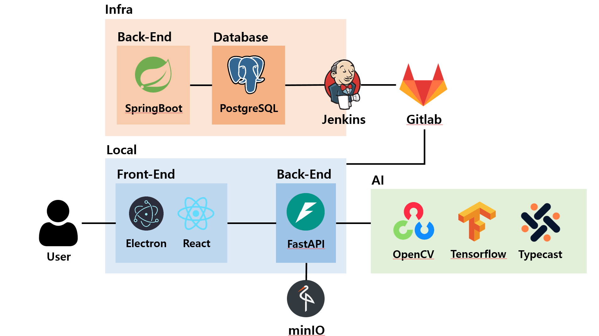

# 🍁 Turkey Games!

---

## ✅프로젝트 진행 기간

2025.04.07 ~ 2025.05.22(6주)

---

## 프로젝트 기획회의 및 규칙 정리 노션

[노션]([https://www.notion.so/1a46bc9b9c5580b59c19f875fd960071?pvs=21](https://yummy-cheese-e90.notion.site/1d5cf1cfbc0f807c8411ff01ea4b47f1?pvs=4))

---

## 🚩 서비스 한줄 소개

보드게임 카페를 위한 디지털이 결합된 인터렉티브 보드 프로젝트

---

## 📌 개요

Turkey Games는 보드게임 카페를 위한 디지털 인터렉티브 보드 프로젝트 입니다.

Turkey Games는 하나의 디스플레이에서 다양한 게임을 제공하며, 디스플레이가 있으면 플레이 할 수 있습니다

---

## 🌱 프로젝트 설명 및 목표

- Turkey Games 는 사용자로 하여금 좀 더 편한 보드게임 환경을 제공
- 게임의 자동 점수 계산, 게임 운영등을 제공

---

## 🛠️ 기술 스택

### **Front-End**

- Vite, React, Nginx

### **Back-End**

- Spring Boot, FastAPI, JPA

### **Database & Cache**

- PostgresSql, Redis

### **Infrastructure & DevOps**

- Docker, Jenkins, AWS EC2, Nginx, Minio

### AI

- Tensorflow

---

## 🚀 주요 기능

### 📍 보드게임 점수 자동 계산 시스템

- 유저들의 점수 계산을 자동으로 해줍니다
- 유저들은 해당 점수를 리스트에 간단히 입력 가능합니다

---

### 📍 보드게임 자동 운영

- 다른 한명의 유저가 따로 운영자로 빠질 필요없이 AI가 자동으로 운영해줍니다

---

### 📍 주사위 눈 자동인식

- AI 모델이 주사위 눈을 자동으로 인식해 보여줍니다

---

## 🛴 통신 방식

### 📍 WebSocket

- 실시간 통신

### 📍 Rest API

- 
    1. **리소스 식별 (Resource Identification);; 이게 핵심**
    - **URI (Uniform Resource Identifier)**: RESTful API에서는 각 리소스를 **URI**로 식별합니다. 리소스는 **명사**로 표현하며, 가능한 한 **복수형**으로 사용합니다.
    - **리소스는 고유하게 식별 가능해야 합니다**. 예를 들어, `users`는 여러 사용자를 나타내고, `users/{userId}`는 특정 사용자를 나타냅니다.
- 
    1. HTTP 메서드 사용 (HTTP Methods)
    - RESTful API에서는 **HTTP 메서드**를 **동사**로 사용하여 리소스에 대해 어떤 작업을 할지 정의합니다.
        - **GET**: 리소스를 조회 (Read)
        - **POST**: 새로운 리소스를 생성 (Create)
        - **PUT**: 기존 리소스를 업데이트 (Update)
        - **DELETE**: 리소스를 삭제 (Delete)
        - **PATCH**: 리소스의 부분 업데이트
    - 각 HTTP 메서드는 **적절한 작업을 수행**하도록 해야 하며, HTTP 상태 코드를 통해 요청 결과를 클라이언트에게 명확하게 전달합니다. 예를 들어:
        - `200 OK`: 성공적인 요청
        - `201 Created`: 리소스가 성공적으로 생성됨
        - `400 Bad Request`: 잘못된 요청
        - `404 Not Found`: 리소스가 존재하지 않음
        - `500 Internal Server Error`: 서버 에러
- 
    1. 무상태성 (Statelessness)
    - **상태 저장하지 않기**: RESTful API는 **무상태(stateless)**를 지향합니다. 즉, **서버가 클라이언트의 상태를 저장하지 않으며, 클라이언트가 각 요청마다 필요한 모든 정보를 포함하여 보냅니다**.
    - **상태 저장이 없으면 서버가 클라이언트의 이전 요청을 기억할 필요가 없으므로 서버가 더 효율적으로 동작할 수 있습니다**.
    - 클라이언트는 **각 요청에서 모든 필요한 정보(예: 인증 토큰)를 포함하여 보내야** 하며, 서버는 이를 기반으로 요청을 처리합니다.

---

## 👨‍💻 팀원

| 이름 | 역할 |
| --- | --- |
| 김지홍[팀장] | Back-End, AI |
| 김동현 | Back-End, Infra |
| 김가현 | AI |
| 권은채 | Front-End |
| 도경록 | Back-End, Front-End |
| 이현석 | Back-End, AI |
| 유지웅 | AI |

## 📌 역할 및 담당 업무

### 김지홍 [Back-End, AI] (팀장)

- 게임 하이라이트 기능 구현

### 김동현 [Back-End, Infra]

- 인프라 구축

### 김가현 [AI]

- 사용자 자동 위치 판별 AI 제작

### 권은채 [Front-End]

- 대시보드 프론트앤드 구현

### 도경록 [Back-End, Front-End]

- 게임 데이터 DB 구현
- 게임보드 프론트앤드 로직 구현

### 이현석 [Back-End, AI]

- 게임 플로우 구현

### 유지웅 [AI]

- 주사위 눈 인식 AI 모델 개발

## 🌐 시스템 아키텍처


## 📂 자료구조
```
├───exec
├───fastapi
│   ├───5sec_tester
│   ├───app
│   │   ├───cache
│   │   ├───config
│   │   ├───db
│   │   ├───fivesec
│   │   ├───routers
│   │   ├───seat
│   │   │   └───calib_camera
│   │   ├───video
│   │   ├───websocket
│   │   └───yacht
│   ├───aruco_marker
│   │   ├───captures
│   │   └───src
│   │       └───oldver
│   ├───dice detection
│   │   └───exported_model
│   │       ├───checkpoint
│   │       ├───saved_model
│   │       │   ├───variables
│   │       │   ├───variables_before
│   │       │   ├───variables_before2
│   │       │   └───variables_before3
│   │       ├───saved_model2
│   │       │   └───variables
│   │       └───test_model
│   │           ├───juy
│   │           │   ├───exported_model3_2_2
│   │           │   │   └───variables
│   │           │   └───exported_model4
│   │           │       └───variables
│   │           └───morgan
│   │               └───exported_model3
│   │                   └───variables
│   ├───seat_people
│   │   ├───images
│   │   └───previous
│   │       ├───seat_prev1
│   │       └───seat_prev2
│   │           └───images
│   └───yatch_tester
├───spring
│   ├───gradle
│   │   └───wrapper
│   └───src
│       ├───main
│       │   ├───java
│       │   │   └───com
│       │   │       └───ssafy
│       │   │           └───spring
│       │   │               ├───common
│       │   │               │   └───response
│       │   │               ├───config
│       │   │               ├───controller
│       │   │               ├───dto
│       │   │               │   └───dashb
│       │   │               │       ├───request
│       │   │               │       └───response
│       │   │               ├───entity
│       │   │               │   └───typehandler
│       │   │               ├───mapper
│       │   │               └───service
│       │   │                   └───serviceImpl
│       │   └───resources
│       │       └───mappers
│       └───test
│           └───java
│               └───com
│                   └───ssafy
│                       └───spring
│                           ├───config
│                           └───controller
└───TurkeyGames
    ├───apps
    │   ├───dashboard
    │   │   └───src
    │   │       ├───api
    │   │       ├───assets
    │   │       │   ├───images
    │   │       │   │   ├───gameimages
    │   │       │   │   └───ranks
    │   │       │   └───voice
    │   │       │       ├───daegil
    │   │       │       ├───flower
    │   │       │       └───guri
    │   │       ├───components
    │   │       │   ├───common
    │   │       │   │   ├───Button
    │   │       │   │   └───PlayerOption
    │   │       │   └───games
    │   │       │       └───TurkeyDice
    │   │       ├───contexts
    │   │       ├───hooks
    │   │       ├───pages
    │   │       │   └───games
    │   │       │       └───TurkeyDice
    │   │       ├───routes
    │   │       └───utils
    │   └───gameboard
    │       └───src
    │           ├───api
    │           ├───assets
    │           │   ├───effect
    │           │   ├───effects
    │           │   │   ├───bullet
    │           │   │   ├───explosion
    │           │   │   ├───heart
    │           │   │   ├───star
    │           │   │   └───thunder
    │           │   ├───images
    │           │   └───sound
    │           │       ├───arcade
    │           │       ├───daegil
    │           │       │   ├───fh
    │           │       │   ├───ls
    │           │       │   ├───myturn
    │           │       │   ├───poker
    │           │       │   ├───reroll
    │           │       │   ├───seat
    │           │       │   ├───ss
    │           │       │   ├───start
    │           │       │   ├───turkey
    │           │       │   └───winner
    │           │       ├───default
    │           │       │   ├───button
    │           │       │   └───start
    │           │       ├───explosion
    │           │       ├───flower
    │           │       │   ├───fh
    │           │       │   ├───ls
    │           │       │   ├───myturn
    │           │       │   ├───poker
    │           │       │   ├───reroll
    │           │       │   ├───seat
    │           │       │   ├───ss
    │           │       │   ├───start
    │           │       │   ├───turkey
    │           │       │   └───winner
    │           │       ├───guri
    │           │       │   ├───fh
    │           │       │   ├───ls
    │           │       │   ├───myturn
    │           │       │   ├───poker
    │           │       │   ├───reroll
    │           │       │   ├───seat
    │           │       │   ├───ss
    │           │       │   ├───start
    │           │       │   ├───turkey
    │           │       │   └───winner
    │           │       └───turkey
    │           ├───components
    │           │   ├───common
    │           │   │   └───spinTurkey
    │           │   └───turkeyDice
    │           │       ├───Arcade
    │           │       ├───test
    │           │       ├───turkeyDiceEffect
    │           │       ├───TurkeyDiceScoreCard
    │           │       └───turkeyDiceScoreCardV1
    │           ├───constant
    │           ├───pages
    │           │   ├───defaultPage
    │           │   ├───testPage
    │           │   ├───turkeyDiceArcadePage
    │           │   ├───turkeyDiceDefaultPage
    │           │   └───turkeyDicePage
    │           ├───routes
    │           │   ├───defaultRoute
    │           │   ├───testRoute
    │           │   └───turkeyDiceRoute
    │           └───utils
    ├───dist
    ├───electron
    ├───nginx
    └───public
```
